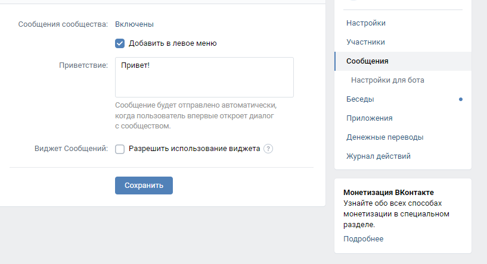

# Чат-бот в телеграм и vk
Бот работает одновременно в телеграм и вкотакте. Готов к деплою на heroku. 
## Env
Необходимы следующие переменные окружения:
- BOT_TOKEN - str, токен от [BotFather](https://t.me/botfather)
- BOT_REPORT_TOKEN - str, токен для бота-логгера
- GOOGLE_APPLICATION_CREDENTIALS - str, путь до файла с кредами [Google](https://cloud.google.com/docs/authentication/getting-started)
- GOOGLE_PROJECT_ID - str, ID проекта из [консоли](https://console.cloud.google.com/home) Google
- QUESTIONS_FILE  - str, путь до файла для обучения чат-бота
- VK_BOT_TOKEN - str, токен для диалога с группой в vk 
- CHAT_ID - str, telegram id админа для логов

## Работа
